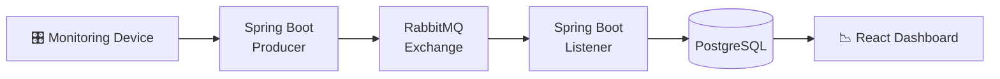

# Motor Monitor Backend V2

Revamped backend for the [Motor Monitor](https://motor-monitor-frontend.vercel.app/) induction motor monitoring system. Handles sensor data ingestion, alarm detection, and real-time metrics processing via a message-driven architecture.

## Tech Stack

- **Runtime:** Java 17, Spring Boot
- **Database:** PostgreSQL
- **Messaging:** RabbitMQ
- **Utilities:** Lombok, Spring Web
- 
## Data Flow


## Running Locally

Ensure Docker is running, then from the project root:

```bash
docker compose up
```

This starts the app, PostgreSQL, and RabbitMQ together.

## API Reference

With the app running, visit the [Swagger UI](http://localhost:8080/swagger-ui/index.html) for full API documentation.

## Legacy Code

To view the original code base used for the research project, visit [motor-monitor-backend-v1](https://github.com/kirkalyn13/motor-monitor-backend).

## Author

[Engr. Kirk Alyn Santos](https://github.com/kirkalyn13)

## License

[MIT](https://choosealicense.com/licenses/mit/)