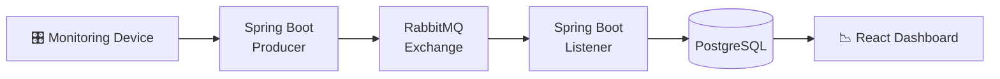

# Motor Monitor Backend V2

Revamped backend for the [Motor Monitor](https://motor-monitor-frontend.vercel.app/) induction motor monitoring system. Handles sensor data ingestion, alarm detection, and real-time metrics processing via a message-driven architecture.

## Tech Stack

- **Runtime:** Java 17, Spring Boot
- **Database:** PostgreSQL
- **Messaging:** RabbitMQ
- **Utilities:** Lombok, Spring Web
- 
## Data Flow


## Running Locally

Ensure Docker is running, then from the project root:

```bash
docker compose up
```

This starts the app, PostgreSQL, and RabbitMQ together.

## API Reference

With the app running, visit the [Swagger UI](http://localhost:8080/swagger-ui/index.html) for full API documentation.

## Infrastructure (`/infra`)

This directory contains all Infrastructure as Code (IaC) using Terraform.
For dev purposers, it provisions and manages AWS-like resources locally via LocalStack for testing.

### Structure
- `modules/` – Reusable Terraform modules (e.g., EC2, VPC, networking components)
- `environments/` – Environment-specific configurations (local, dev, prod-ready layout)
- `main.tf` – Root module entry point
- `variables.tf` – Input variables
- `outputs.tf` – Output values

```bash
terraform init
terraform plan
terraform apply
```

### Local Development (LocalStack)

This project uses LocalStack to emulate AWS services locally for safe testing.

```bash
tflocal init
tflocal plan
tflocal apply
```

## Related Projects

To view the original code base used for the research project, visit [motor-monitor-backend-v1](https://github.com/kirkalyn13/motor-monitor-backend).

## Author

[Engr. Kirk Alyn Santos](https://github.com/kirkalyn13)

## License

[MIT](https://choosealicense.com/licenses/mit/)